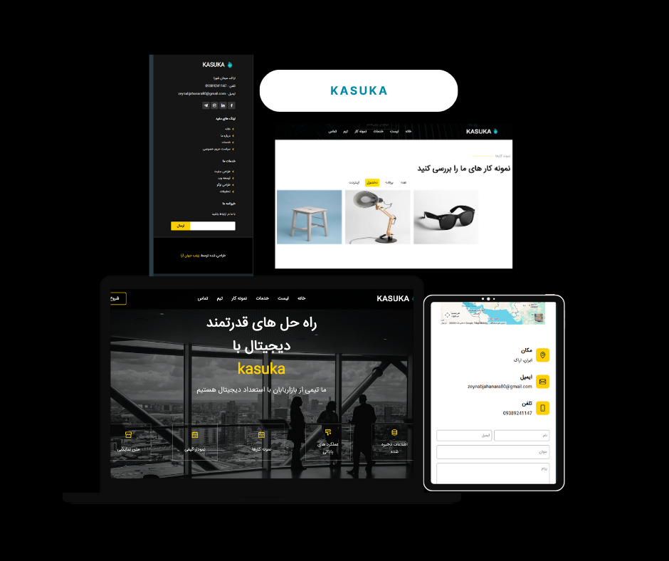

<p align="center">
  
</p>
developed by Zeynab Jahanara
# Kasuka Landing Page

**Kasuka** is a modern, responsive landing page built with **React** and **Vite**, designed to showcase products, services, or any content in a clean and visually appealing layout. The project is hosted on **GitHub Pages**.

---

## Features

- Fully **responsive design** for mobile, tablet, and desktop devices.
- Built with **React** components for modularity and reusability.
- **Vite** powered for fast build and optimized performance.
- Includes **FontAwesome**, **BoxIcons**, and **Bootstrap Icons**.
- Easy to customize images, text, and sections.
- Smooth navigation and interactive elements.

---

## Project Structure
kasuka/
├─ public/
│ ├─ imgs/ # All static images
│ └─ dependencies/ # FontAwesome and other libraries
├─ src/
│ ├─ components/ # React components
│ ├─ App.jsx
│ └─ main.jsx
├─ index.html
├─ package.json
├─ vite.config.js
└─ README.md


- **public**: Contains static assets like images and external JS/CSS files. Files here are copied directly to the build output.
- **src**: Contains all React components and app logic.
- **vite.config.js**: Configuration file for Vite, including base path for GitHub Pages deployment.

---

##  Getting Started

### 1. Clone the repository
```bash
git clone https://github.com/zjahanara80/kasuka.git
cd kasuka
Install dependencies
npm install

3. Run the development server
npm run dev


The app will be available at http://localhost:5173/ (default Vite port).

4. Build for production
npm run build


This will generate a dist/ folder with optimized files ready for deployment.

5. Deploy to GitHub Pages
npm run deploy


Make sure vite.config.js has the correct base path set to your repository name:

base: '/kasuka/'

🌐 Live Demo

You can view the live project here:
https://zjahanara80.github.io/kasuka/

🎨 Customization

Update images inside public/imgs/.

Modify React components inside src/components/.

Change text and layout in JSX files.

Add external libraries or styles if needed.

⚙️ Technologies Used

React

Vite

FontAwesome

BoxIcons

Bootstrap Icons

HTML, CSS, JavaScript

📷 Preview
<p align="center">  </p>
📄 License

This project is licensed under the MIT License. See the LICENSE
 file for details.


